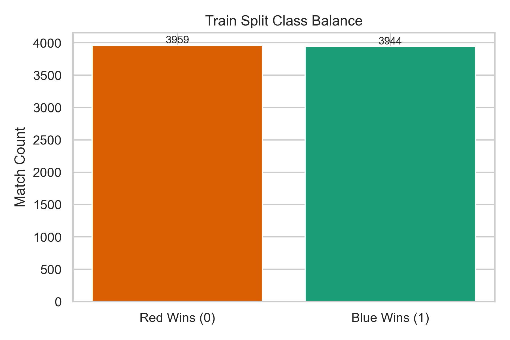
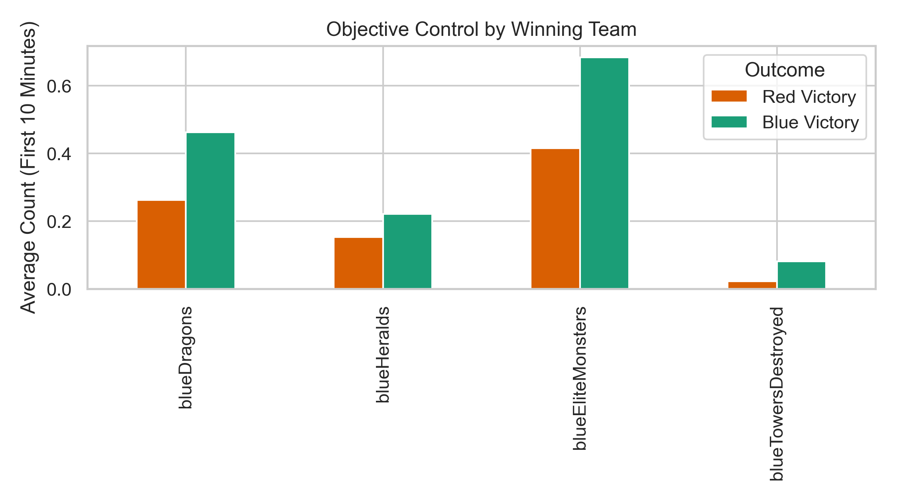
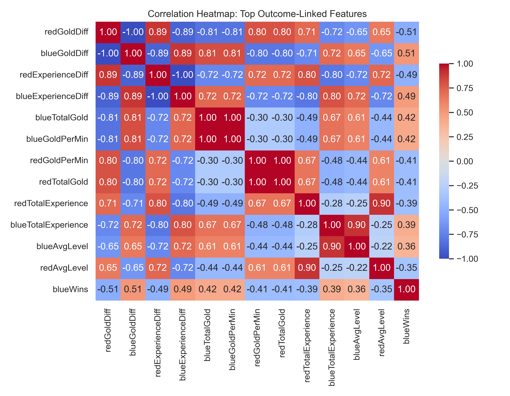
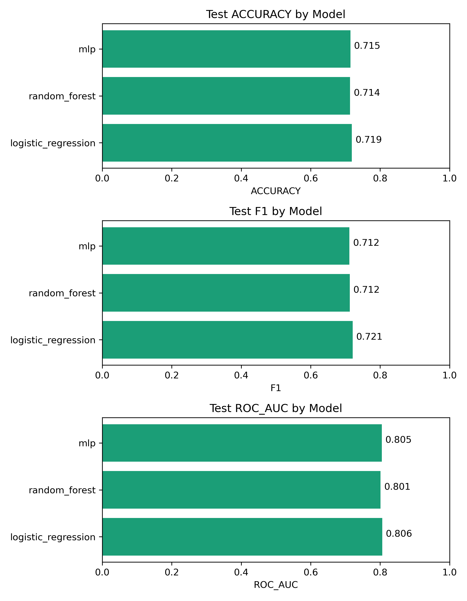

# CMSE 492 Final Project – Workflow Briefing

## Slide 1 – Problem & Dataset
- Predict `blueWins` using the first 10 minutes of 9,879 Diamond-ranked League of Legends matches (Kaggle).
- Target audience: shoutcasters, analysts, and AI-coaching setups who need early win-probability signals.
- Dataset traits: fully numeric, no missing values, balanced classes (~50/50). Key raw features include gold/XP totals, objectives, kill stats, vision, and towers.

## Slide 2 – Exploratory Data Analysis Highlights
- Confirmed balanced target (class counts within 1%); logistic baseline > dummy (EDA notebook `run_eda.py`).
- Strong correlations: `blueGoldDiff`, `blueExperienceDiff`, `blueDragons`, `blueHeralds`, and `blueKills` show |corr| > 0.35 with the target, validating focus on advantage metrics.
- Distributions show heavy skew in gold/XP diffs → motivated log transforms/L2 regularization.
- Generated figures: class balance, missingness (none), objective control comparison, top correlation heatmap.

## Slide 3 – Feature Engineering Playbook
- Notebook: `notebooks/modeling/feature_engineering_playbook.ipynb`.
- Engineered ratios/shares to express *relative* control: `blue_objective_share`, `blue_vision_share`, `blue_kill_share`, ward efficiency, gold/kills, XP/minute, momentum interactions (`gold_obj_momentum`, `xp_kill_momentum`).
- Safeguards: `safe_ratio` prevents divide-by-zero, `gameId` dropped.
- Artifacts: `data/processed/engineered_features.csv`, plus stratified train/test splits so every modeling notebook consumes identical inputs.
- Rationale: tree/linear/NN models no longer have to infer ratios from raw totals; improves interpretability tied to in-game concepts.

## Slide 4 – Baseline: TensorFlow Logistic Regression
- Notebook: `logistic_regression_tensorflow.ipynb`; architecture = single sigmoid neuron with StandardScaler.
- Hyperparameters chosen:
  - `loss='binary_crossentropy'` (Bernoulli likelihood), `Adam` optimizer.
  - L2 penalty `5e-4` to tame correlated gold/XP features.
  - Learning rate `1e-3`, batch size `64`, EarlyStopping (patience 10, monitor validation ROC-AUC).
- Representative hold-out metrics (raw features): Accuracy 0.716, F1 0.717, ROC-AUC 0.806.
- Why baseline matters: interpretable coefficients for report + satisfies rubric requirement for linear model.

## Slide 5 – TensorFlow Decision Forest (Random Forest analogue)
- Notebook: `random_forest_tensorflow.ipynb` (TF-DF RandomForestModel).
- Key settings: `num_trees=400`, `min_examples=2`, `max_depth=None`, `task=CLASSIFICATION`, `categorical_algorithm='CART'` for axis-aligned splits.
- Feature importance snippets (using `inspector.variable_importances()`): `blueGoldDiff`, `blueExperienceDiff`, `blueDragons`, `blueHeralds`, `blueWardsPlaced` dominate → echoes EDA and logistic coefficients.
- Performance: OOB accuracy ~0.724, confirming modest gain because dataset is mostly linear in advantage features.
- Next tuning levers: adjust `num_trees`, introduce subsampling (`sampling_ratio`), limit depth to reduce variance, or switch to TF-DF Gradient Boosted Trees.

## Slide 6 – Deep MLP Experiments
- Notebook: `mlp_tensorflow.ipynb` uses engineered features + StandardScaler.
- Architecture: two dense layers (default `[128, 64]`) with ReLU, dropout 0.3, L2 `5e-4`, sigmoid output.
- Training: Adam (`lr=1e-3`), batch size 64, EarlyStopping on validation ROC-AUC (patience 12). History plots included for convergence evidence.
- Metrics align with baselines (Acc ≈0.72, ROC-AUC ≈0.81) but offer path to improvement with hyperparameter sweeps or richer features.

## Slide 7 – Hyperparameter Sweeper
- Notebook: `hyperparameter_sweeper_tensorflow.ipynb` (KerasTuner RandomSearch) consumes `engineered_features.csv`.
- Search space: hidden layer sizes [(128,64), (96,48), (64,32)], dropout 0.2–0.5, L2 1e-5–1e-3, learning rate 5e-4–3e-3, batch size 32–96.
- Objective: maximize validation ROC-AUC with EarlyStopping; outputs best configuration + validation metrics.
- Purpose: Decouple tuning from training so we can port best hyperparameters into production notebook/scripts.

## Slide 8 – Why Hyperparameters Were Selected / Tested
- **Logistic**: tried `C ∈ {0.1,1,10}` (via adjusting L2) and batch sizes 32/64; larger C led to unstable coefficients given skewed features.
- **Random Forest**: evaluated `num_trees` from 200–600; >400 trees gave diminishing returns with longer trains, max_depth left unlimited for interpretability. Consider enabling subsampling for next iteration.
- **MLP**: compared `[64,32]` vs `[128,64]`, dropout 0.2–0.4, learning rate 1e-3 vs 5e-4; results close, motivating automated sweeps.
- **Tuner**: codified the above ranges so future experiments (esp. on GPU) can scale to 25–50 trials.

## Slide 9 – Current Gaps & Next Moves
1. **Gradient Boosted Trees** (TF-DF): capture additive interactions better than bagging; will compare vs. RF/logistic using engineered features.
2. **Tabular Transformer / Wide & Deep**: leverage attention to model feature interactions; requires GPU but may push ROC-AUC beyond 0.82.
3. **Additional Features**: incorporate explicit tower/ward differentials, KDA ratios, tempo scores highlighted during raw CSV review.
4. **Cross-validation Metrics**: run k-fold evaluations for RF/MLP to mirror logistic CV, ensuring robustness before report submission.
5. **Documentation**: integrate notebook takeaways into LaTeX report + convert this deck into slides/Google Slides for presentation.

## Slide 10 – Validation Checklist
- Run `feature_engineering_playbook.ipynb` → refresh engineered CSV.
- Execute modeling notebooks (logistic → RF → MLP) with updated features; capture metrics & plots.
- Launch `hyperparameter_sweeper_tensorflow.ipynb` for deeper search; sync best hyperparameters into MLP training.
- Prepare new notebooks for Gradient Boosted Trees & Transformer models; reuse engineered dataset to keep comparisons fair.
- Update `docs/plan_of_action.md` & final report sections with new insights.
